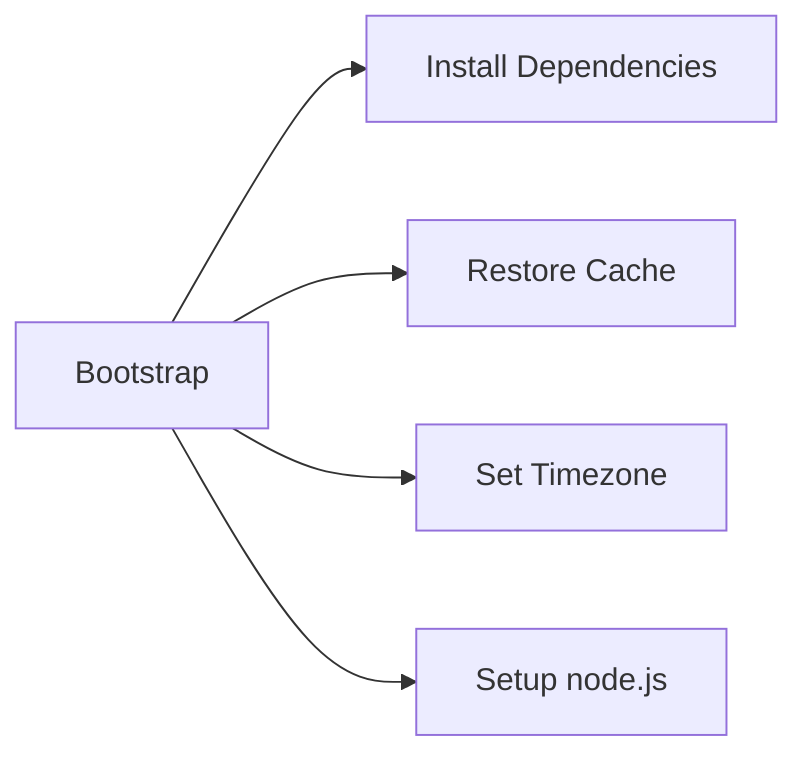
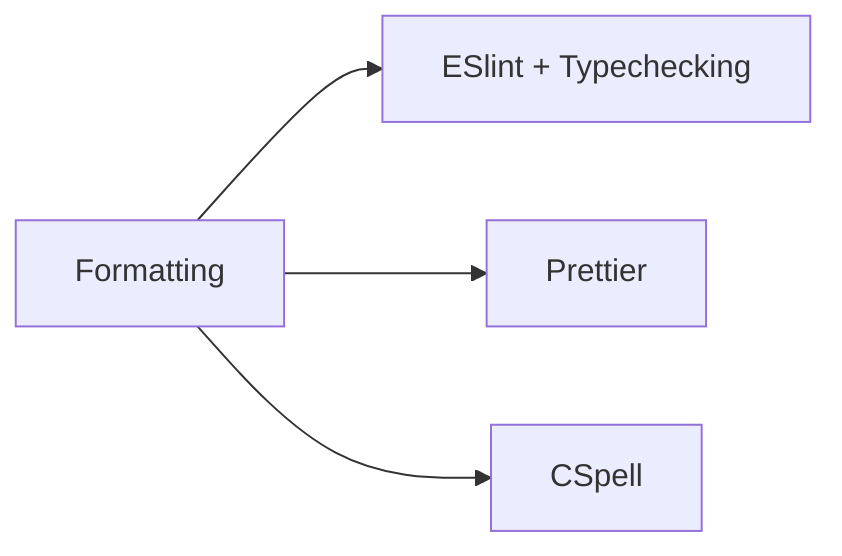

# CI

## Prerequisites

Our project is TypeScript monorepo with a file structure like this:

`client`: Next + express based static client \
`server`: internal API server for the client \
`public-api`: public API server \
`shared`: shared code \
`db-layer`: db connection related code \

We don't use a build system and manage everything using npm, standard Next compiler and tsc for builds.

## Old workflow

Our old workflow was pretty simple with a run on every push to PR or on commit to the master and develop branch with the single job under the hood:

```yml
name: CI

on:
  pull_request:
    types: [opened, synchronize, reopened, ready_for_review]
  push:
    branches: [develop, master]

concurrency:
  group: ${{ github.workflow }}-${{ github.ref }}
  cancel-in-progress: true

jobs:
  static-code-analysis:
    runs-on: ubuntu-latest
    if: github.event.pull_request.draft == false
    steps:
      - uses: actions/checkout@v3
      - uses: actions/setup-node@v3

      - name: Cache node modules
        id: cache-npm
        uses: actions/cache@v3
        env:
          cache-name: cache-node-modules
        with:
          path: |
            **/node_modules
          key: ${{ runner.os }}-build-${{ env.cache-name }}-${{ hashFiles('**/package-lock.json') }}
          restore-keys: |
            ${{ runner.os }}-build-${{ env.cache-name }}-
            ${{ runner.os }}-build-
            ${{ runner.os }}-
      - if: ${{ steps.cache-npm.outputs.cache-hit != 'true' }}
        name: Install dependencies on all repositories
        run: npm run all-install

      - name: Test client
        run: npm --prefix ./client run test

      - name: Test server
        run: npm --prefix ./server run test

      - name: Lint and type check
        run: npm run all-lint

      - name: Format check
        run: npm run check:prettier

      - name: Spell check
        run: npm run check:cspell
```

As you can see there are several problems with this workflow:

- Static analysis for the entire project, no matter what was changed
- The same with the unit tests, the workflow will run the tests for the `client` even when you change the README file or the `server`
- No e2e and integration tests run for the application, closed and public API
- Sequential run of the tests and linting

## New unit tests and linting workflow

The brand-new concept was made to resolve the issues above. We've split our workflow by the directory structure into five and the one to skip required jobs for the files that are not present in the other workflows. So the typical workflow looks like this:

```yml
name: Client CI

env:
  app_name: client

on:
  pull_request:
    types: [opened, synchronize, reopened, ready_for_review]
    paths:
      - 'client/**'
      - '!**.md'
      - 'shared/**'
  push:
    paths:
      - 'client/**'
      - '!**.md'
      - 'shared/**'
    branches: [develop]

concurrency:
  group: ${{ github.workflow }}-${{ github.ref }}
  cancel-in-progress: true

jobs:
  lint-and-test:
    runs-on: ubuntu-latest
    if: github.event.pull_request.draft == false
    steps:
      - uses: actions/checkout@v3

      - name: Bootstrap
        uses: './.github/actions/bootstrap'

      - name: Formatting
        uses: './.github/actions/format'
        with:
          dir: ${{env.app_name}}

      - name: Test
        working-directory: ${{ env.app_name }}
        run: npm run test
```





For the `shared` and `db-layer` folders, we just omit the testing part.

## E2E workflow

We used a matrix approach to run our Cypress tests in parallel. So it looks like this (some not important parts was changed or removed):

```yml
name: E2E tests

on:
  pull_request_review:
    types: [submitted]
  push:
    branches: [develop]

concurrency:
  group: ${{ github.workflow }}-${{ github.ref }}
  cancel-in-progress: true

jobs:
  should-run:
    if: github.event.review.state == 'approved'
    runs-on: ubuntu-latest
    outputs:
      approved: ${{ steps.approved.outputs.approved }}
      files-changed: ${{ steps.changes.outputs.closed-api }}
    steps:
      - uses: luisrjaeger/approved-event-checker@1.0.0
        id: approved
        with:
          approvals: 2
          check_changes_requested: false
        env:
          GITHUB_TOKEN: ${{ secrets.GITHUB_TOKEN }}
  e2e:
    if: ${{needs.should-run.outputs.approved == 'true'}}

    timeout-minutes: 10
    strategy:
      fail-fast: false
      matrix:
        spec: ['1', '2']
    runs-on: ubuntu-latest
    steps:
      - uses: actions/checkout@v3

      - name: Bootstrap
        uses: './.github/actions/bootstrap'

      # We don't use `service` feature of the GitHub actions to run e.g. `mysql` because it's not as configurable as a docker-compose file and since we already use it for local development, it's pretty easy to just run the containers in the workflow directly.
      - name: Run containers
        run: docker compose up --wait -d

      # Before the e2e run we don't have any images or artifacts of our project so we just run in in the background.
      - name: Run server
        run: npm run server:e2e > server-log${{matrix.spec}} &

      - name: Run tests
        run: npm run e2e

      - name: Save screenshots
        if: failure()
        uses: actions/upload-artifact@v3
        with:
          name: screenshots
          if-no-files-found: ignore
          path: ./e2e/screenshots*

      - name: Save logs
        if: failure()
        uses: actions/upload-artifact@v3
        with:
          name: logs
          if-no-files-found: ignore
          path: ./server-log*
```

## Money saving technics

- ChatGPT knows. But use it wisely, almost all the time you can ask it something like "please make it simple" or "simplify" and the suggested solution becomes much better. Reformulate your request if the answers seem strange or inappropriate. And of course don't forget to use your own head :smile:
- because of the big dependency base and monorepo structure
- combine linting and testing jobs into the single job
- move small steps to the job itself even if it will do the task several times
- move everything you can outside of the matrix
- extensions for vs code
  - [GitHub Actions](https://marketplace.visualstudio.com/items?itemName=cschleiden.vscode-github-actions)
- don't forget to build your frontend - it will save you a lot of time

## Problems

- Deprecations
- Required workflows (path filtering)
- Testing wastes money - consider using some repo with a similar project structure as a playground

## Next steps

- CD
- Optimize e2e test running time by splitting the entire suite by the execution time of the tests, not randomly.
- Using some build system to simplify the CI => manage the dependencies correctly
- Optimization of build and run services and containers
