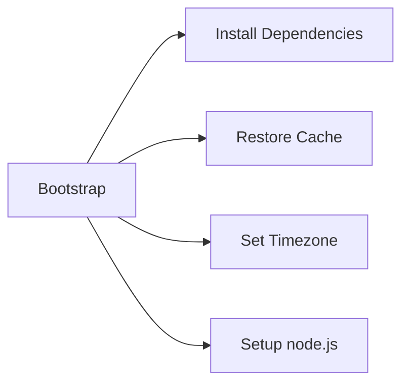
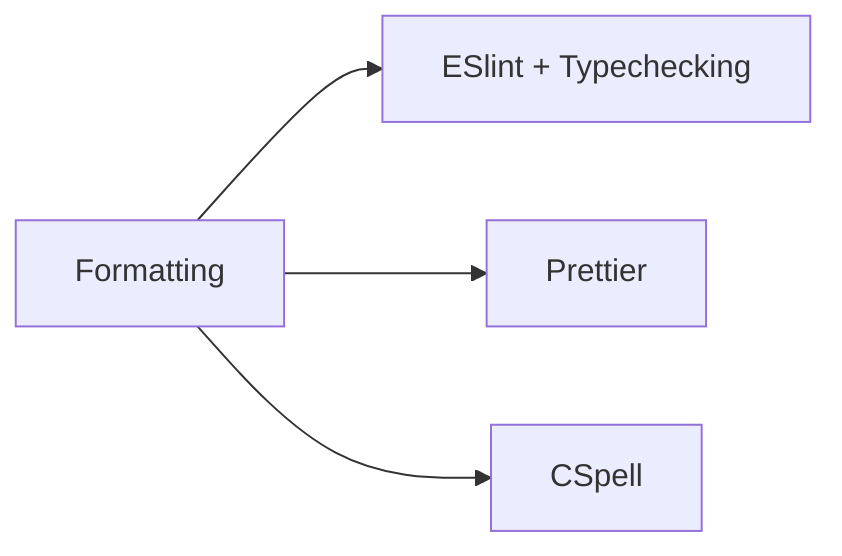

# CI

## Prerequisites

Our project is TypeScript monorepo with a file structure like this:

`client`: Next + express based static client \
`server`: internal API server for the client \
`public-api`: public API server \
`shared`: shared code \
`db-layer`: db connection related code \

We don't use a build system and manage everything using npm, standard Next compiler and tsc for builds.

## Old workflow

Our old workflow was pretty simple with a run on every push to PR or on commit to the master and develop branch with the single job under the hood:

```yml
name: CI

on:
  pull_request:
    types: [opened, synchronize, reopened, ready_for_review]
  push:
    branches: [develop, master]

concurrency:
  group: ${{ github.workflow }}-${{ github.ref }}
  cancel-in-progress: true

jobs:
  static-code-analysis:
    runs-on: ubuntu-latest
    if: github.event.pull_request.draft == false
    steps:
      - uses: actions/checkout@v3
      - uses: actions/setup-node@v3

      - name: Cache node modules
        id: cache-npm
        uses: actions/cache@v3
        env:
          cache-name: cache-node-modules
        with:
          path: |
            **/node_modules
          key: ${{ runner.os }}-build-${{ env.cache-name }}-${{ hashFiles('**/package-lock.json') }}
          restore-keys: |
            ${{ runner.os }}-build-${{ env.cache-name }}-
            ${{ runner.os }}-build-
            ${{ runner.os }}-
      - if: ${{ steps.cache-npm.outputs.cache-hit != 'true' }}
        name: Install dependencies on all repositories
        run: npm run all-install

      - name: Test client
        run: npm --prefix ./client run test

      - name: Test server
        run: npm --prefix ./server run test

      - name: Lint and type check
        run: npm run all-lint

      - name: Format check
        run: npm run check:prettier

      - name: Spell check
        run: npm run check:cspell
```

As you can see there are several problems with this workflow:

- Static analysis for the entire project, no matter what was changed
- The same with the unit tests, the workflow will run the tests for the `client` even when you change the README file or the `server`
- No e2e and integration tests run for the application, closed and public API
- Sequential run of the tests and linting

## New unit tests and linting workflow

The brand-new concept was made to resolve the issues above. We've split our workflow by the directory structure into five and the one to skip required jobs for the files that are not present in the other workflows. So the typical workflow looks like this:

```yml
name: Client CI

env:
  app_name: client

on:
  pull_request:
    types: [opened, synchronize, reopened, ready_for_review]
    paths:
      - 'client/**'
      - '!**.md'
      - 'shared/**'
  push:
    paths:
      - 'client/**'
      - '!**.md'
      - 'shared/**'
    branches: [develop]

concurrency:
  group: ${{ github.workflow }}-${{ github.ref }}
  cancel-in-progress: true

jobs:
  lint-and-test:
    runs-on: ubuntu-latest
    if: github.event.pull_request.draft == false
    steps:
      - uses: actions/checkout@v3

      - name: Bootstrap
        uses: './.github/actions/bootstrap'

      - name: Formatting
        uses: './.github/actions/format'
        with:
          dir: ${{env.app_name}}

      - name: Test
        working-directory: ${{ env.app_name }}
        run: npm run test
```





For the `shared` and `db-layer` folders, we just omit the testing part.

## E2E workflow

We used a [matrix](https://docs.github.com/en/actions/using-jobs/using-a-matrix-for-your-jobs) approach to run our Cypress tests in parallel. So it looks like this (some not important parts were changed or removed):

```yml
name: E2E tests

on:
  pull_request_review:
    types: [submitted]
  push:
    branches: [develop]

concurrency:
  group: ${{ github.workflow }}-${{ github.ref }}
  cancel-in-progress: true

jobs:
  # We run e2e tests right before the merge to develop branch after 2 PR approvals
  should-run:
    if: github.event.review.state == 'approved'
    runs-on: ubuntu-latest
    outputs:
      approved: ${{ steps.approved.outputs.approved }}
    steps:
      - uses: './.github/actions/approvals'
        id: approved
  # Before the e2e run we don't have any images or artifacts of our project.
  # So ve build our Next app here and reuse it in our matrix jobs
  build:
    runs-on: ubuntu-latest
    needs: should-run
    if: ${{needs.should-run.outputs.approved == 'true'}}
    steps:
      - uses: actions/checkout@v3
      - name: Bootstrap
        uses: './.github/actions/bootstrap'

      - name: Build client
        run: npm run build

      - uses: actions/upload-artifact@v3
        with:
          name: dist
          path: client/dist
          if-no-files-found: error
    e2e:
      strategy:
        fail-fast: false
        matrix:
          spec: [1, 2, 3, 4, 5, 6, 7, 8, 9, 10]
      runs-on: ubuntu-latest
      needs: build
      steps:
        - uses: actions/checkout@v3

        - name: Bootstrap
          uses: './.github/actions/bootstrap'

        # We don't use `service` feature of the GitHub actions to run e.g. `mysql` because it's not as configurable as a docker-compose file and since we already use it for local development, it's pretty easy to just run the containers in the workflow directly.
        - name: Run containers
          run: docker compose up

        # Run in background and save logs to the file
        - name: Run server
          run: npm run server > server-log${{matrix.spec}} &

        - uses: actions/download-artifact@v3
          with:
            name: dist
            path: client/dis

        # Same with the client
        - name: Run client
          run: npm run client > client-log${{matrix.spec}} &

        - name: Wait for server and client
          run: |
            npm run wait -- http://localhost:15000/echo -t 120000
            npm run wait -- http://localhost:3000 -t 60000

        # Here works the script that splits all our test files into 10 parts
        # and pass them as a list of parameters to the cypress run --spec
        - name: Run tests
          uses: './.github/actions/e2e'
          with:
            dir: application
            split-into: 10
            file-num: ${{matrix.spec}}

        # Save screenshots of failed tests and logs of the client and server
        - name: Save screenshots
          if: failure()
          uses: actions/upload-artifact@v3
          with:
            name: screenshots
            if-no-files-found: ignore
            path: e2e/cypress/screenshots/**

        - name: Save logs
          if: failure()
          uses: actions/upload-artifact@v3
          with:
            name: logs
            path: ./*-log*
```

## Money saving technics

### ChatGPT knows

Use it wisely, almost all the time you can ask it something like "please make it simple" or "simplify" and the suggested solution becomes much better. Reformulate your request if the answers seem strange or inappropriate. And of course don't forget to use your own head :smile:

### Combine small jobs

You can combine linting and testing jobs into one because linting itself doesn't take much time. But you also need to do a checkout and install/restore from cache the dependencies if you run it in a separate job. So basically combining them doesn't make a big difference in time but allows you to save some money. It's also applicable to every small job even if it will do the task several times

### Move everything outside of the matrix

Especially builds and other expensive steps.

### Use extensions and reuse existing Actions

For VS Code you can use an [extension](https://marketplace.visualstudio.com/items?itemName=cschleiden.vscode-github-actions) that will show you the errors in your workflow before the run (hello Jenkins).

And of course don't overthink your own solution if it exists on the [market](https://github.com/marketplace?type=actions), just use it.

## Problems

### Lots of extensions use deprecated libs

I face a serious problem during the development that a lot of useful actions available on the market don't receive any updates for months or even years and there are no fresh alternatives. So be sure to check the warnings from GitHub and be ready to replace them with self-written solutions.

### Path filtering and required jobs

Don't forget to use [special workflows](https://docs.github.com/en/repositories/configuring-branches-and-merges-in-your-repository/defining-the-mergeability-of-pull-requests/troubleshooting-required-status-checks#handling-skipped-but-required-checks) for skipped but required checks or you can't merge your PR that changes something beyond the path filtering conditions in your workflows.

### Testing might be expensive

You can enjoy the power of free GitHub Actions access on a personal account, you can easily repeat the structure of your project and run similar workflows for testing purposes on the playground. It will also allow you to decrease feedback loop time.

## Next steps

We made a lot of work to improve our workflow, but I know that we can do better, especially in the execution time, so here is what I suggest to make in the future:

### Optimize e2e test running time by splitting the entire suite by the execution time of the tests, not randomly splitting them

Our current tests splitting is very simple, it just uses `find` and `split`:

```bash
find cypress/tests -type f -name "*.spec.ts" > $input_file
split --lines=$lines_per_file $input_file "./tmp/spec_" --numeric-suffixes=1
```

But it's not the best solution since execution time per job may vary significantly. So we can analyze Cypress logs and execution time, and make the test distribution more rational.

- Using some build system to simplify the CI => manage the dependencies correctly
- Optimization of build and run services and containers
